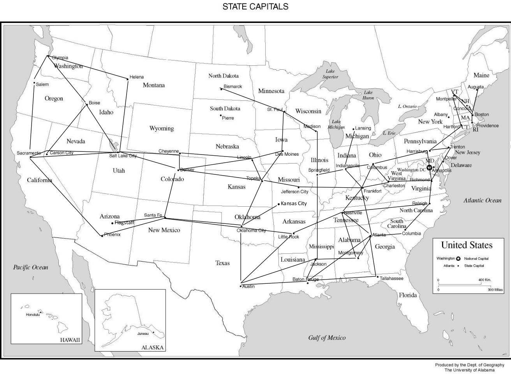

# Path Finder
Implements 3 search algorithms to route between cities in this map:

The 3 algorithms are as follows: Breath First Search, Depth First Search, and A*.
The goal of this project was to show completeness and experiment with the algorithms as
opposed to speed.

## Usage
Compile:
```
javac -cp ./src/ -d out/production/Path-Finder src/main/java/Search.java
```
Execute:
```
java -cp out/production/Path-Finder/ main.java.Search [input] [output]
```
Input should be either a file to read from or `-` to denote reading from stdin.
Output should be either a file to write the output to or `-` to denote the output
should go to stdout.